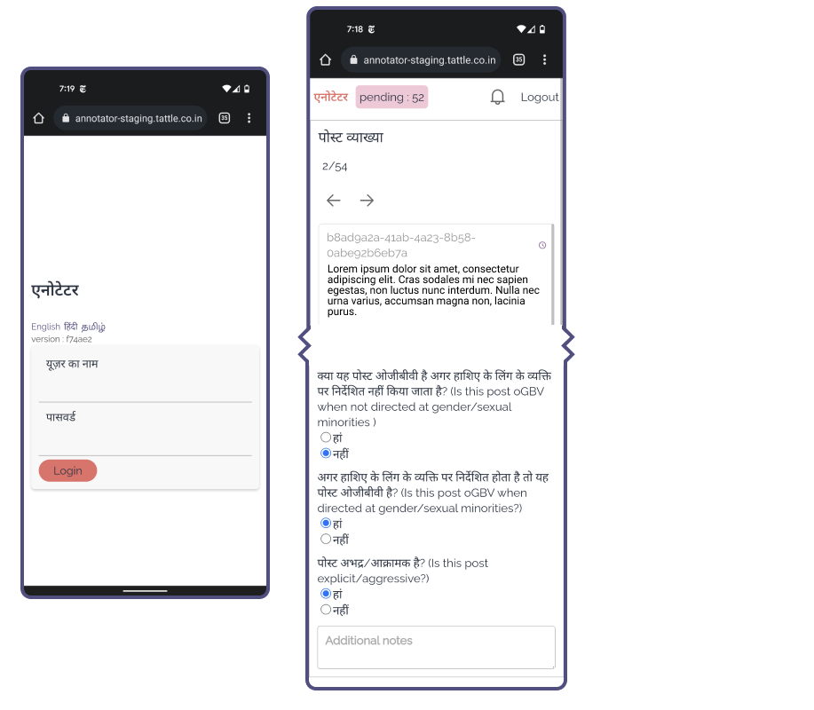

# Annotation UI
This tool was created to crowdsource annotations.

## Features :
- User Management
- Supports Localization for English, Hindi and Tamil



## Instruction to Run the Project

### Backend & Database

- Change director to `annotators`:

```bash
cd annotators
```

- Run Docker script to bring u:

```bash
docker-compose up
```

- Change directory to `annotators/backend`:

```bash
npm install
```

- Change directory to `sequelize`:

```bash
cd sequelize
```

- Open http://localhost:8080 ( Admnier running upon - DB GUI ) & login using [these credentails](./annotators/backend/sequelize/config/config.js#L3-#L5)

> **Note:** Update [MySQL Port](./annotators/docker-compose.yml#L14) if you are running it on another port, [Update here](./annotators/backend/sequelize/config/config.js#L7)

- Run this to create the tables in db:

```bash
npx sequelize-cli db:migrate
```

- Run & insert users named tarunima, arnav etc. You will have to check the db to see their password. which is stored in plain text for now - this will run the script located [here](https://github.com/tattle-made/OGBV/blob/main/annotators/backend/sequelize/seeders/20211115172651-beta-test.js) :

```bash
npx sequelize-cli db:seed --seed 20211115172651-beta-test
```
