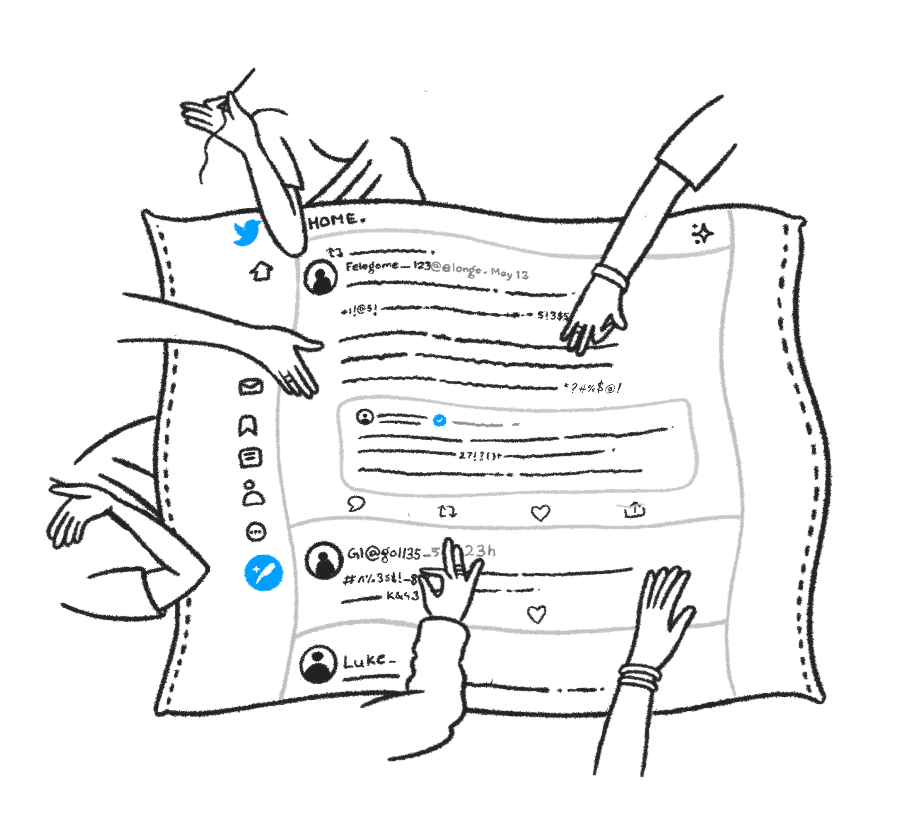

<p align="center">
	<a href="http://uli.tatle.co.in"></a>
	<br>
	<h2 align="center">Moderate your Twitter Feed</h2>
</p>


## Features
- Automatic Slur Replacement for Languages spoken in India (Currently supported Tamil, Hindi and English)
- Archive Tweets
- Invoke Networks

<p align="left">
	
</p>


## Code Organization
| Directory | Description | 
| --- | --- |
| plugin | code for browser extension |
| api-server | a rest server for storing user preferences and archived tweets |

# Build from Source

Requirements :
- npm : v8.7.0
- nodejs : 16.4.2

## For Development
```
git clone https://github.com/tattle-made/OGBV.git
cd browser\ extension/
cd plugin && npm install
cd ..
cd api-server && npm install
docker-compose up
```
Now you can run the development server for the following entities in different tabs/windows and monitor their logs :
| Service | Command To Run |
| --- | --- | 
| api server | cd api-server && nodemon index.js |
| content script | cd plugin && npm run start:contentScript | 
| options page | cd plugin && npm run start:options |

If all services run correctly, you should be able to load the plugin from `plugin/dist` folder into Chrome or Brave browser.
To learn how to install unreleased extension in your browser follow the instructions [here](https://webkul.com/blog/how-to-install-the-unpacked-extension-in-chrome/)

Look into individual README within the `api-server` and `plugin` folder for more info.

## For Production
```
cd plugin && npm run build
```

