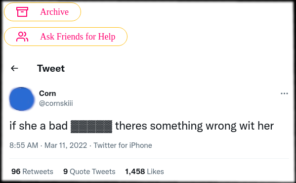
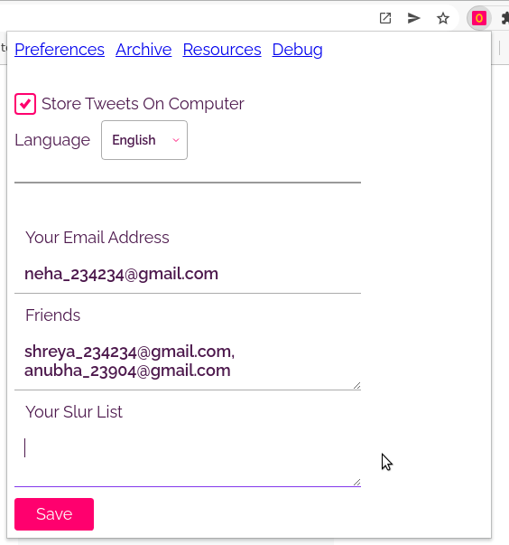
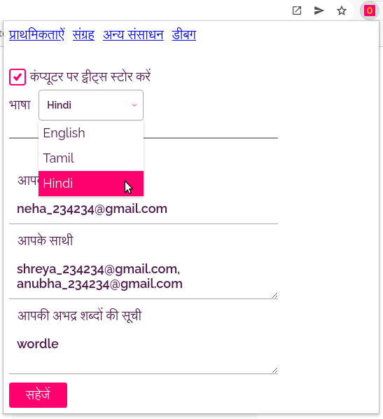

# Developing Locally

All the code is organized into the `/src` folder. The extension uses content-script and popup page, both of which are bundled by parcel and placed in the `/dist` folder.

In three different tabs, run the following commands - `npm run start:options` and `npm run start:contentScript` and `npm run moveBuildArtefactsToDistDir` one after the other.
These commands should place a few files in the `/dist` folder. The files of interest are - `options.html`, `options.js` and `content-script.js`

At this point, try to load the plugin by following an online guide like [this](https://webkul.com/blog/how-to-install-the-unpacked-extension-in-chrome/)

Since Parcel runs a development server with live reload, any changes you make to your `/src` files will be bundled and served in the `/dist` folder and you should be able to try it out on extension right away.

Sometimes you might have to press the reload button of your extension in the chrome://extensions tab.

# Building The Extension

run `npm run build` and it will give you a bundled and minified files in the `/dist` folder. This can then be shared to share the extension with others.

