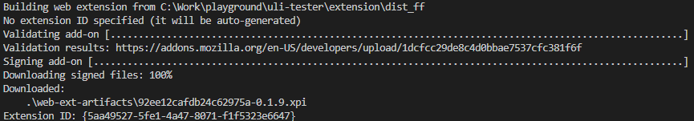

# OGBV ML REST Server

v:0.0.1

## Developing Locally

1. Clone the repository in your local machine and navigate to the 'ogbv-ml-rest' folder.
2. Run the following command to build the docker. Note that if you are on a Windows machine, you will need to change the file format of the 'download_model' file to 'unix'. More information on this can be found [here](https://tanutaran.medium.com/solving-git-lf-will-be-replaced-by-crlf-7ca84eb0aad4) and [here](https://stackoverflow.com/questions/19425857/env-python-r-no-such-file-or-directory).

```
docker build -t ml .
```

3. After your docker is built, run it using the following command:

```
docker run  -p 8080:80 -v ogbv-cache:/root/.cache/huggingface/transformers -v ogbv-assets:/app/assets ml
```

If this is the first time you are running the container, then this will create volumes: ogbv-assets and ogbv-cache and link them to the directories created for the container, from the next time onwards, the volumes will persist and even if the container perishes, running this command will immediately fetch the data from the volumes to the relevant directories saving time and data. Please delete the volumes and rerun this command when the models itself are updated.

4. Test the API endpoint by running the following command:

```
curl -X POST http://localhost:8080/predict -H 'Content-Type: application/json' -d '{"text":"The food in this restaurant is disgusting"}'
```

Note that if you are on windows and are using PowerShell, you might need to run this command instead of the previous one for making POST requests:

```
Invoke-RestMethod -Method 'Post' -Uri http://localhost:8080/predict -Body (@{"text"="The food in this restaurant is disgusting"}|ConvertTo-Json) -ContentType "application/json"
```

## Testing

1. Go to the following url and download the extension zip file present in the release: https://github.com/tattle-made/OGBV/releases
2. Extract the files locally and put the path to the dist folder present in the newly extracted files in the "options.add_argument" function in the slur_detection_tester.py file
3. Run the following in your test environment (in order):

```
pip install selenium
pip install webdriver-manager
```

4. Find a tweet with a known slur, you can look them up here: https://github.com/tattle-made/OGBV/blob/main/browser-extension/plugin/src/slur-replace.js. You'll need to hardcode the url in the "driver.get()" function. A known url is the following: https://twitter.com/jackantonoff/status/1579311659742416896. This should set you up for running the code.

### Using Docker-Compose

1. Start the following backend services using the docker-compose:

    1. SQL Database
    2. REST API Server for Uli
    3. OGBV ML REST

```
cd browser-extension
docker-compose up
```

2. Start a development server for the plugin:

```
cd browser-extension/plugin
npm run dev:firefox
or
npm run dev:chrome
```

Now you should have a build of the plugin in the browser-extension/plugin/dist folder

3. Running tests: 

    1. If you are on chrome, just putting the absolute path to the dist folder inside the scripts for chrome should be fine to run the tests
    2. If you are on firefox, do the following: 
        1. Note that in order to run the following you need to have `node` installed on your machine. Once that is taken care of, run the following command:
            ```bash

            npm install --global web-ext

            ```
        2. Next, you will need to run the following command inside the dist folder generated upon running a development server:
            ```bash

            web-ext sign --api-key=$WEB_EXT_API_KEY --api-secret=$WEB_EXT_API_SECRET

            ```
            In order to generate your own api key and api secret you may visit the following [page](https://addons.mozilla.org/en-US/developers/addon/api/key/)

        3. This should give you an xpi file inside a "web-ext-artifacts" folder. The response upon successfully running the command should be something like this: 

            

        4. Use the path to this '.xpi' file in the firefox testing scripts for loading the extension in the browser wherever needed. 


